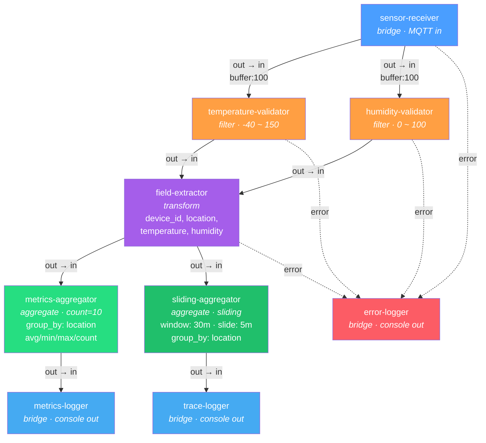

# mqtt-metrics 플로우 다이어그램

센서 데이터를 수신하여 temperature/humidity 필드만 추출하고 location별 메트릭을 생성하는 플로우.
count 윈도우(10건 단위)와 sliding 윈도우(최근 30분, 5분 주기)가 fan-out으로 병렬 실행된다.

## 플로우 토폴로지

## 노드 설명

| 단계 | 노드 | 타입 | 역할 |
|------|------|------|------|
| 1 | sensor-receiver | bridge | MQTT 브로커에서 센서 데이터 수신 (payload_format: json) |
| 2a | temperature-validator | filter | 온도 범위 검증 (-40 ~ 150), 범위 초과 시 error 포트로 라우팅 |
| 2b | humidity-validator | filter | 습도 범위 검증 (0 ~ 100), 범위 초과 시 error 포트로 라우팅 |
| 3 | field-extractor | transform | 원본에서 device_id, location, temperature, humidity만 추출 |
| 4a | metrics-aggregator | aggregate | location별 10건 단위 count 윈도우 집계 (avg, min, max, count) |
| 4b | sliding-aggregator | aggregate | location별 최근 30분 sliding 윈도우 집계, 5분마다 실행 |
| 5 | metrics-logger | bridge | count 집계 결과를 콘솔에 JSON 출력 |
| 6 | trace-logger | bridge | sliding 집계 결과를 콘솔에 JSON 출력 |
| - | error-logger | bridge | 에러 데이터를 [ERROR] 접두사로 출력 |

## 데이터 흐름 특징

- **Fan-out (수신)**: sensor-receiver 출력이 temperature-validator와 humidity-validator로 병렬 분기 (buffer: 100)
- **Fan-in**: 두 validator의 출력이 field-extractor로 합류
- **Fan-out (집계)**: field-extractor 출력이 metrics-aggregator(count)와 sliding-aggregator(sliding)로 병렬 분기
- **Group-By**: 두 집계기 모두 `group_by: "location"`으로 location별 독립 집계 수행
- **Sliding Window**: sliding-aggregator는 최근 30분 메시지를 유지하며, 5분마다 eviction + 집계 실행
- **에러 집중**: 4개 노드의 에러 포트가 모두 error-logger로 연결

## 관련 파일

- 플로우 정의: [`examples/flows/mqtt-metrics.yaml`](../flows/mqtt-metrics.yaml)
- 배포 스크립트: [`examples/scripts/mqtt-metrics.xflow`](../scripts/mqtt-metrics.xflow)
- MQTT 센서 에이전트: [`examples/agents/mqtt-sensor.yaml`](../agents/mqtt-sensor.yaml)
- 콘솔 로거 에이전트: [`examples/agents/console-logger.yaml`](../agents/console-logger.yaml)
- 에러 로거 에이전트: [`examples/agents/error-logger.yaml`](../agents/error-logger.yaml)
