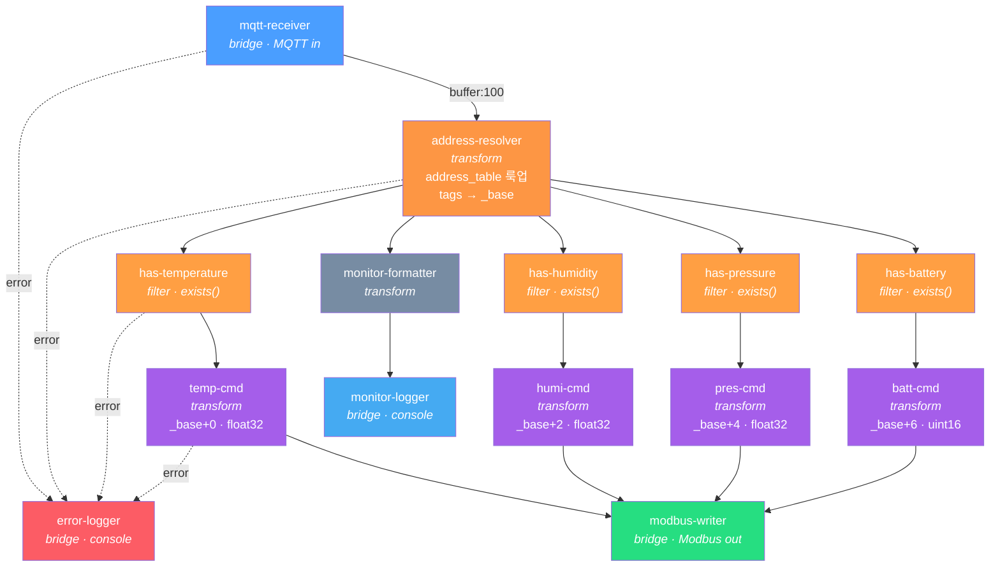

# mqtt-to-modbus 플로우 다이어그램

MQTT 센서 데이터를 수신하여 Modbus/TCP 서버의 Input Registers에 실시간 매핑하는 IoT 게이트웨이 플로우.
문자열 태그 조합을 `address-resolver` 노드의 `address_table`에서 룩업하여 레지스터 주소를 결정한다.

## 어드레스 설정 테이블

### 태그 → 주소 해석 흐름

```
tags(문자열)                address_table 룩업         register_base(정수)
building="A"  ─┐
floor="1F"    ─┼→ 키 생성: "A:1F:L1" ─→ address_table["A:1F:L1"] ─→ 0
line="L1"     ─┘
```

### address_table (address-resolver 노드 config)

| 태그 키 | register_base | 레지스터 범위 |
|:-------:|:-------------:|:-----------:|
| A:1F:L1 | **0** | 0-7 |
| A:1F:L2 | **8** | 8-15 |
| A:2F:L1 | **16** | 16-23 |
| A:2F:L2 | **24** | 24-31 |
| B:1F:L1 | **32** | 32-39 |
| B:1F:L2 | **40** | 40-47 |
| B:2F:L1 | **48** | 48-55 |
| B:2F:L2 | **56** | 56-63 |

디바이스를 추가할 때 `address_table`에 항목을 추가하면 된다.
계산식이 아닌 명시적 매핑이므로 비정규 주소 배치도 가능하다.

### 센서별 오프셋

| 오프셋 | 타입 | 바이트 순서 | 필드 | 예시 |
|:------:|------|:---------:|------|------|
| +0~1 | float32 | big_endian | 온도 (°C) | 23.5 |
| +2~3 | float32 | big_endian | 습도 (%) | 45.2 |
| +4~5 | float32 | big_endian | 기압 (hPa) | 1013.25 |
| +6 | uint16 | - | 배터리 (%) | 87 |
| +7 | - | - | 예약 | - |

### 주소 계산 예시

**A동 1F L1 센서의 온도:**
- tags: building="A", floor="1F", line="L1"
- address_table["A:1F:L1"] = 0, 오프셋 +0
- → Input Register **0**

**B동 2F L2 센서의 습도:**
- tags: building="B", floor="2F", line="L2"
- address_table["B:2F:L2"] = 56, 오프셋 +2
- → Input Register **58**

## 플로우 토폴로지



## 노드 설명

| 단계 | 노드 | 타입 | 역할 |
|------|------|------|------|
| 1 | mqtt-receiver | bridge | MQTT 브로커에서 센서 데이터 수신 |
| 2 | **address-resolver** | **transform** | **address_table로 태그 문자열 → register_base 해석** |
| 3a | has-temperature | filter | temperature 필드 존재 여부 검사 |
| 3b | has-humidity | filter | humidity 필드 존재 여부 검사 |
| 3c | has-pressure | filter | pressure 필드 존재 여부 검사 |
| 3d | has-battery | filter | battery 필드 존재 여부 검사 |
| 4a | temp-cmd | transform | `set_input` 커맨드 (_base+0, float32) |
| 4b | humi-cmd | transform | `set_input` 커맨드 (_base+2, float32) |
| 4c | pres-cmd | transform | `set_input` 커맨드 (_base+4, float32) |
| 4d | batt-cmd | transform | `set_input` 커맨드 (_base+6, uint16) |
| 5 | modbus-writer | bridge | 모든 커맨드를 fan-in 수신하여 Modbus 서버로 전송 |
| 6 | monitor-formatter | transform | 모니터링용 요약 (태그, _base 포함) |
| 6 | monitor-logger | bridge | 콘솔에 JSON 출력 |
| - | error-logger | bridge | 에러를 [ERROR] 접두사로 출력 |

## 부분 페이로드 처리

온도, 습도, 기압이 항상 함께 수신되지 않을 수 있다.
각 필드별 `exists()` 필터로 존재하는 값만 해당 레지스터에 기록한다.

**온도만 포함된 메시지 (A동 1F L1):**
```json
{
  "payload": {
    "deviceInfo": {
      "devEui": "a1b2c3d4e5f60001",
      "tags": { "building": "A", "floor": "1F", "line": "L1" }
    },
    "object": { "temperature": 23.5 }
  }
}
```
→ address_table["A:1F:L1"] = 0
→ `has-temperature` 통과 → Input Register **0-1**에 float32(23.5) 기록
→ `has-humidity`/`has-pressure`/`has-battery` 드롭 (필드 없음)

**습도+배터리 (B동 2F L2):**
```json
{
  "payload": {
    "deviceInfo": {
      "devEui": "a1b2c3d4e5f60008",
      "tags": { "building": "B", "floor": "2F", "line": "L2" }
    },
    "object": { "humidity": 62.3, "battery": 91 }
  }
}
```
→ address_table["B:2F:L2"] = 56
→ `has-humidity` 통과 → Input Register **58-59**에 float32(62.3) 기록
→ `has-battery` 통과 → Input Register **62**에 uint16(91) 기록

## 확장

### 디바이스 추가

address_table에 항목을 추가하면 된다. 계산식이 아닌 명시적 매핑이므로 비정규 주소 배치도 가능하다.

```yaml
address_table:
  "A:1F:L1": 0
  "A:1F:L2": 8
  # 신규 추가
  "C:1F:L1": 64
  "C:1F:L2": 72
```

서버 에이전트의 `input_registers.count`도 함께 늘려야 한다.

## 관련 파일

- 플로우 정의: [`examples/flows/mqtt-to-modbus.yaml`](../flows/mqtt-to-modbus.yaml)
- 배포 스크립트: [`examples/scripts/mqtt-to-modbus.xflow`](../scripts/mqtt-to-modbus.xflow)
- MQTT 센서 에이전트: [`examples/agents/mqtt-sensor.yaml`](../agents/mqtt-sensor.yaml)
- Modbus 게이트웨이 서버: [`examples/agents/modbus-gateway-server.yaml`](../agents/modbus-gateway-server.yaml)
- 콘솔 로거 에이전트: [`examples/agents/console-logger.yaml`](../agents/console-logger.yaml)
- 에러 로거 에이전트: [`examples/agents/error-logger.yaml`](../agents/error-logger.yaml)
